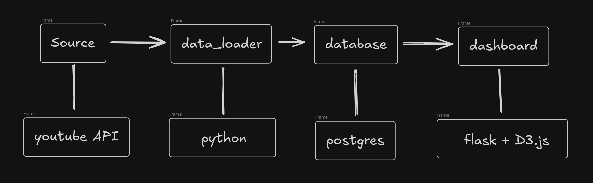
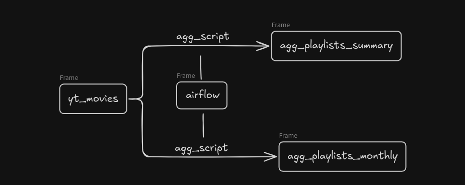
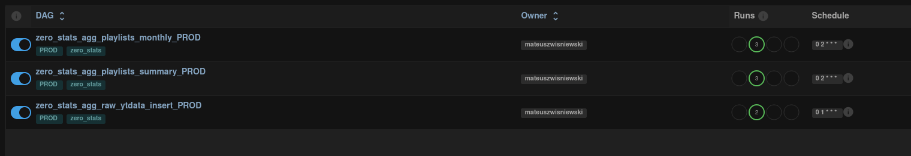

# YouTube Statistics Dashboard

## 📑 Table of Contents
- [🛠️ Technologies](#️-technologies)
- [🔄 Process Overview](#-process-overview)
- [📋 Process Details](#-process-details)
    - [📡 Sources](#-sources)
    - [🐘 PostgreSQL](#-postgresql)
    - [⚙️ Data processing and orchestration](#️-data-processing-and-orchestration)
    - [📊 Dashboard](#-dashboard)

## 🎯 Goal   
- 📥 **collect data from YouTube API**
- 🗂️ **organize data**
- 📊 **show summary on Dashboard**

## 🛠️ Technologies
- **Backend+Frontend:** 🐍 Flask,  🌐 nginx (reverse proxy), 📊 D3.js
- **Database:** 🐘 PostgreSQL
- **Orchestration:** 🔄 Apache Airflow
- **Deployment:** 🐳 Docker Compose
- **Hosting:** ☁️ mikr.us
- **Data Collection:** 🐍Python, 🤖YouTube API

## 🔄 Process Overview

## 📋 Process Details

### 📡 Sources
Youtube API

**Data collection process:**
- 🔍 **Playlist discovery** - fetching all playlists from the YouTube channel
- 📹 **Video cataloging** - collecting videos from each playlist
- 📊 **Statistics retrieval** - views, likes, publication dates
- 💾 **Database storage** - saving data in the `yt_movies` table
- 🔄 **Update** - periodically refreshing statistics of existing videos
- ⚡ **Optimization** - batch processing (50 videos per request) to save API quota

### 🐘 PostgreSQL
Tables:
- yt_movies
- agg_playlists_summary
- agg_playlists_monthly

SQL Scripts
- 📂[DDL](https://github.com/mwisniewski1991/zero_stats/tree/master/app/database_definitions/ddl)
- 📂[Aggregations](https://github.com/mwisniewski1991/zero_stats/tree/master/app/database_definitions/aggregations)

### ⚙️ Data processing and orchestration

🔄 Calculations are performed at the database level and are run using the Airflow application (it is hosted on my home Homelab).

DAGs are ver simple and launch calculation on Database server.
📂 [Link to DAGs directory](https://github.com/mwisniewski1991/iot_personal_hub/tree/master/app/airflow)

dags list:
- zero_stats_agg_raw_ytdata_insert_PROD - fetches data from the API
- zero_stats_agg_playlists_summary_PROD - creates aggregate playlist summary
- zero_stats_agg_playlists_monthly_PROD - creates monthly playlist summary

### 📊 Dashboard

**Available visualizations:**

- **📊 Videos in Playlists** - Interactive bar charts for each playlist showing views of individual videos.
  - Tooltips with exact values and video titles
  - Average views line (dashed)

- **📊 Monthly Playlists** - Bar charts presenting monthly playlist statistics since January 2024:
  - Total views per month for each playlist
  - Number of videos in each month
  - Average views line

- **🏆 Playlist Ranking** - Interactive DataTables table with:
  - Statistics: total views, likes, average values
  - Sorting by total views (default)

**Visualization technology:** D3.js v7 with responsive design and dark theme
